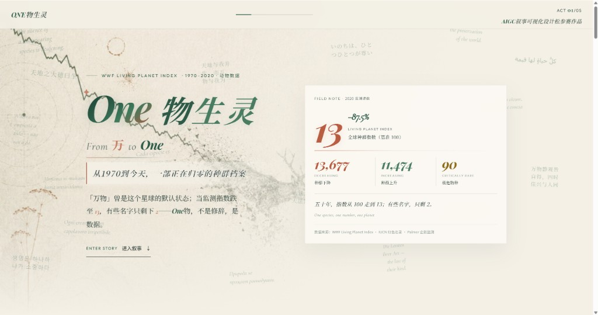

# One物生灵

从1970到今天，一部正在归零的种群档案



## 查看作品（必看）

**不要直接双击 HTML 文件。** 请用本地服务器：

```powershell
cd "C:\Users\16399\Desktop\0613AIGC_刘彦成\最终作品\public"
python -m http.server 8080
```

浏览器打开：**http://localhost:8080/?v=4**（加版本号可清缓存）

左侧图表随右侧滚动叙事同步切换。支持鼠标悬停探索、点击筛选等交互。

## 配图生成

见根目录 `IMAGE_PROMPTS.md`，生成后放入 `public/img/`。

## 重新生成数据

```powershell
cd "C:\Users\16399\Desktop\0613AIGC_刘彦成\最终作品"
python scripts/preprocess.py
```

## 项目结构

- `public/` — 演示入口（index.html）
- `public/data/` — 预处理 JSON
- `scripts/preprocess.py` — 数据清洗
- `ai-collaboration.md` — 人机协作复盘

## 五幕叙事

1. 全球 LPI 种群指数
2. 各大洲对比
3. 濒危物种威胁 + 个案
4. 保护等级 × 食性
5. 企鹅健康 + 体重
