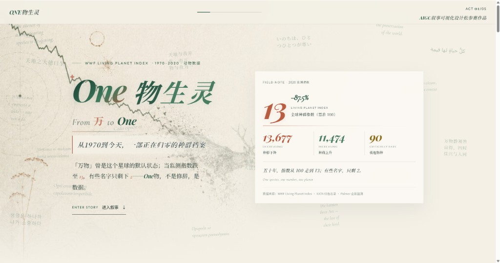

<div align="center">



# 🌍 One 物生灵 · OneWuShengLing

### 从 1970 到今天，一部正在归零的种群档案

_不是把数据堆成仪表盘，而是用五幕滚动叙事，把一场静默的生态崩塌讲给你听。_

<br/>


</div>

---

> ### 📉 100 → 13
> 1970 至今，全球脊椎动物监测种群数量的中位数下降了 **87%**。
> 有些物种的名字后面，只剩下**个位数**。斑鳖，全球已知仅剩 **3** 只。

这不是一句修辞，而是这个项目想让你**亲手滚动着读完**的事实。

---

## 🎬 五幕叙事

滚动即阅读——左侧图表随右侧文案同步切换，先读懂故事，再探索细节。

| 幕 | 主题 | 你会看到 |
| :--: | :--- | :--- |
| 🌐 **第一幕** | 全球大盘 | LPI 地球生命力指数 1970–2020 的整体崩落曲线 |
| 🗺️ **第二幕** | 区域落差 | 坡度图对比大洋洲、亚洲等各大洲的降幅差异 |
| 🐢 **第三幕** | 物种个案 | 种群计数只剩个位数的极危物种档案卡 |
| 🚦 **第四幕** | 保护等级 | 基于 IUCN 红色名录的受威胁种群分布光谱 |
| 🐧 **第五幕** | 微观信号 | 南极企鹅的体重与脂肪指标，以体征预警生态偏移 |

---

## ✨ 特性

- **🎞️ 五幕流式叙事**：Intersection Observer 驱动的零依赖滚动监测，文案与图表精准同步。
- **📈 交互式 LPI 探索**：动态折线图，支持 1970–2020 逐年悬停探索。
- **⚖️ 区域命运对比**：坡度图直观呈现各大洲衰退的不平等。
- **🆘 极端濒危档案**：把"指数下降"具象成"名字只剩个位数"的痛感。
- **🪶 轻量化数据引擎**：Python(Pandas) 预烘焙，3.6 万行原始 CSV → KB 级轻量 JSON。
- **🌑 沉浸式视觉**：深色背景 + 生态绿强调色，响应式布局，实时交互反馈。

---

## 🚀 快速开始

```bash
# （可选）重新预处理数据
pip install pandas
python scripts/preprocess.py

# 本地启动演示（任意静态服务器即可）
cd public
python -m http.server 8000
# 浏览器打开 http://localhost:8000
```

---

## 📂 目录结构

```text
OneWuShengLing/
├── public/               # 演示主体：HTML / CSS / JS + 预烘焙 JSON
├── scripts/              # Python 数据预处理（清洗·指数化·导出）
├── data/                 # 多源原始数据（WWF LPI / IUCN / Palmer Penguins）
├── assets/               # 封面等静态资源
├── IMAGE_PROMPTS.md      # 视觉生成记录
└── ai-collaboration.md   # 人机协作与方法论说明
```

---

## 🔬 数据与方法

数据来源：**WWF Living Planet Index (2024)**、**IUCN Red List**、**Palmer Penguins Dataset**。
尾声章节透明标注了 LPI 中位数的计算逻辑与人机协作过程——数据叙事，也要经得起追问。

---

## 📄 许可证

[MIT License](LICENSE) · 数据版权归各原始机构所有，本项目仅作科普与教育用途。

<div align="center">

<br/>

_每一次滚动，都是一次凝视。_ 🐋

**如果它让你停下来想了几秒，欢迎点一颗 ⭐**

</div>
